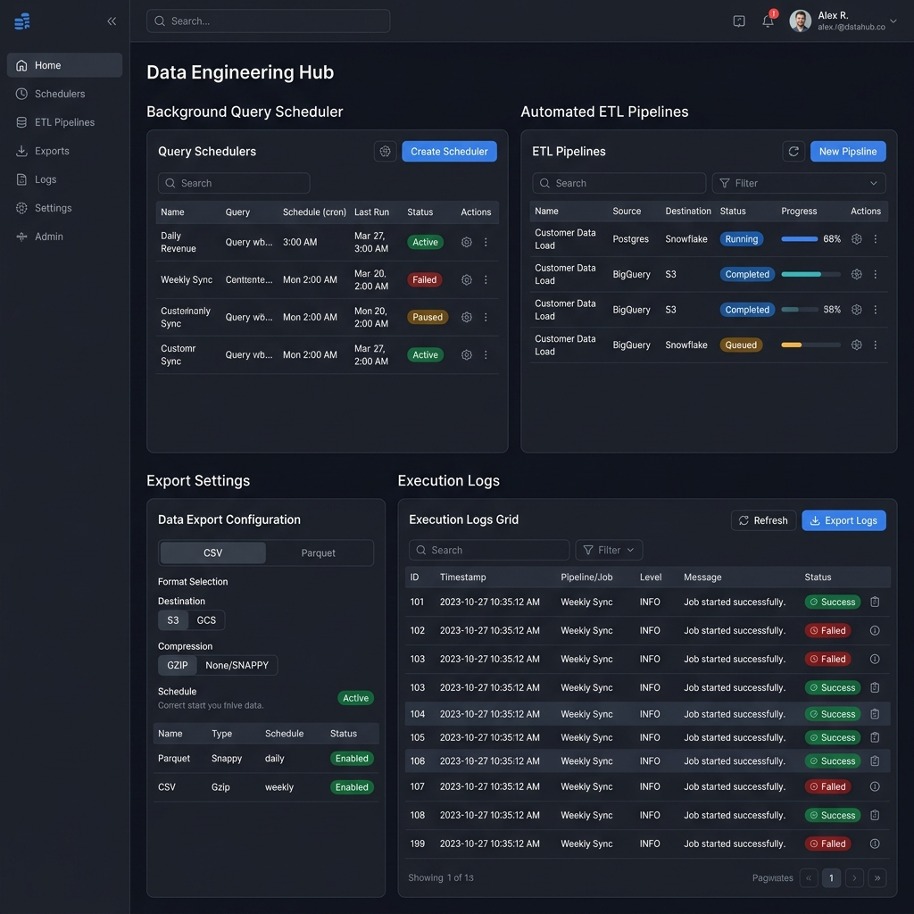

# 📖 DuckDB Studio & API Explorer Manual

Welcome to the official user manual for **DuckDB Studio & API Explorer**. This document provides detailed, step-by-step instructions on utilizing the diverse capabilities of this high-performance database management platform.

---

## 🧭 Navigating the Workspace

DuckDB Studio organizes its toolset into specialized workspace tabs:

| Workspace Tab | Icon | Purpose |
| :--- | :---: | :--- |
| **Explorer** | `query_stats` | Database schema catalog, visual column structure query builder, and ad-hoc SQL console. |
| **JupyterLab** | `terminal` | Embedded Jupyter console terminal for writing integrated Python and pandas data science notebooks. |
| **Extensions** | `extension` | Graphical DuckDB extension repository enabling one-click library installation and loading. |
| **Database Tools** | `construction` | Utility workshop containing database schema backups, schema restores, and test data seeding routines. |
| **API Endpoints** | `api` | Dynamic REST API compiler, custom parameter binders, and live endpoints manager. |
| **API Docs & Explorer** | `menu_book` | OpenAPI interactive Swagger playground and Loopback testing sandbox. |
| **Scheduler** | `schedule` | Background automation query scheduler, Parquet/CSV exporter, and telemetry logs. |

---

## 🛠️ Step-by-Step Feature Walkthroughs

### 1. Designing & Exposing REST APIs ⚡
With DuckDB Studio, exposing local datasets to production web apps is instantaneous:

1. Navigate to the **API Endpoints** tab.
2. In **Create API Endpoint**, choose a descriptive route path (e.g. `top-sales`).
3. Enter your SQL select query. You can add dynamic request filters using the `$parameter_name` notation:
   ```sql
   SELECT name, price, stock FROM product_inventory WHERE stock >= $min_stock;
   ```
4. Click **Create Endpoint**.
5. *Premium Tip*: If you are unsure of column names or want to generate automatic filters, click **Analyze Columns for Auto-Params**, check the columns you want to query against, choose a comparator (e.g. `>=`, `=`), and let the system compile the query for you!

---

### 2. Live API Telemetry & Performance Monitoring 📈
Every invocation to your dynamically exposed REST routes is captured by our metrics logging framework.


1. Open the **API Endpoints** tab and scroll down to the **Live API Telemetry & Performance Dashboard**.
2. **KPI Metrics Panel**: Review global performance summaries:
   - **Active API Routes**: Total count of custom endpoints running on the FastAPI router.
   - **Total Requests**: Cumulative number of HTTP requests handled.
   - **Avg Latency**: Average response time in milliseconds.
   - **Success Rate**: Live health ratio (successful `2xx` vs failed `5xx` responses).
3. **Endpoint Performance Table**: Dive deep into per-route metrics. The logs trace row counts, latency limits, min/max bounds, success ratios, and last trigger times.
4. **Resets**: Click **Clear Telemetry Logs** to flush the database and start a fresh profiling session.

---

### 3. Background Query Schedulers & Automations ⏰
Automate your reporting and analytical pipelines directly from the user interface.



#### Creating a Scheduled Job:
1. Navigate to the **Scheduler** tab.
2. Choose **Preset: Load from Saved Query** to populate the form using a saved SQL query snippet, or type in a fresh query manually.
3. Choose a name and choose a periodic interval (options range from `Every Minute` to `Daily`).
4. Select the export format:
   - **Parquet** (High-performance compressed columnar data)
   - **CSV** (Standard comma-separated text)
   - **JSON** (Structured object data)
5. **Partitioning**: Under **Partition Column (Optional)**, type in a database column name (e.g., `category`). DuckDB will dynamically split the exports folder into partitioned subfolders natively!
6. Enter an export base filename and click **Create Export Job**.

#### Managing Scheduled Exports:
* **Manual Run**: Click the **Run Now** (`play_circle_outline`) button to execute the query immediately, trace rows, and export files to `/exports/` on-demand.
* **Pause / Resume**: Toggle the execution state with the `pause` / `play_arrow` button.
* **Audit Execution Logs**: Check the **Job Execution Logs** table at the bottom to verify execution duration, processed rows, and exact output file sizes (e.g., `2.45 MB`).

---

## 📂 Directories & Mounted Storage

When executing file operations or scheduling query dumps, the app uses standard relative mounts inside the project root:
* **Database Mounts**: Located in `/databases/`. Perfect for loading or attaching sqlite databases, duckdb files, or raw logs.
* **Scheduler Exports**: Automated background query results are dumped directly into `/exports/` relative to the workspace directory.
