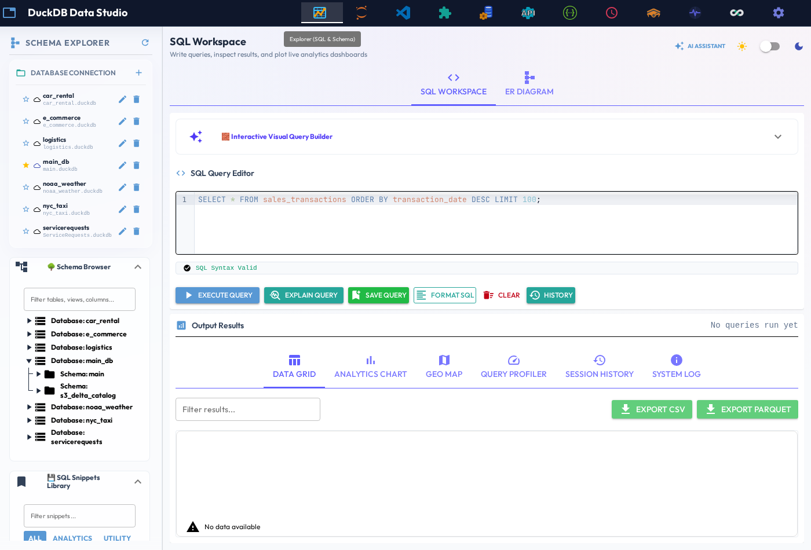
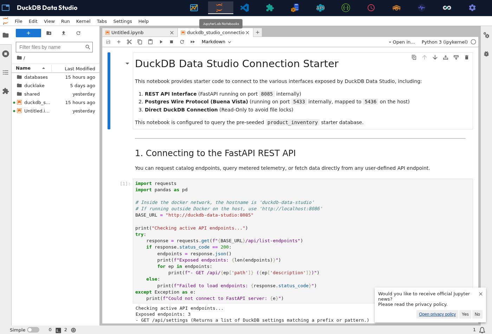
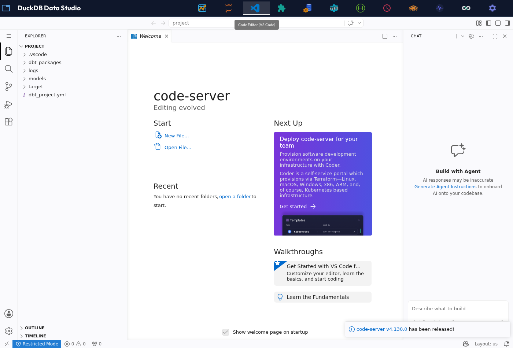
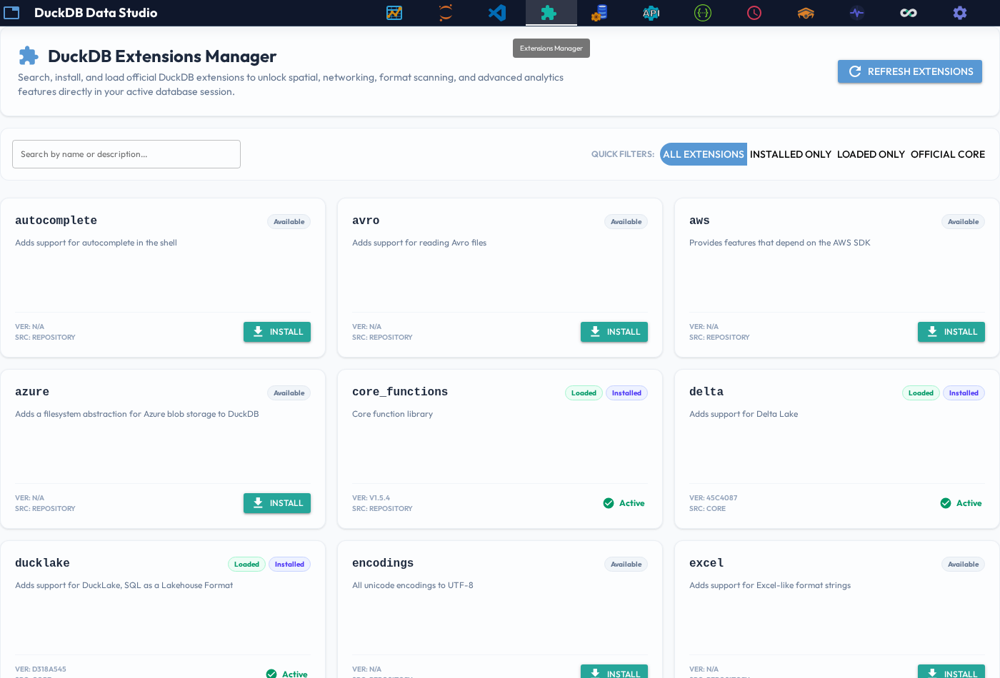
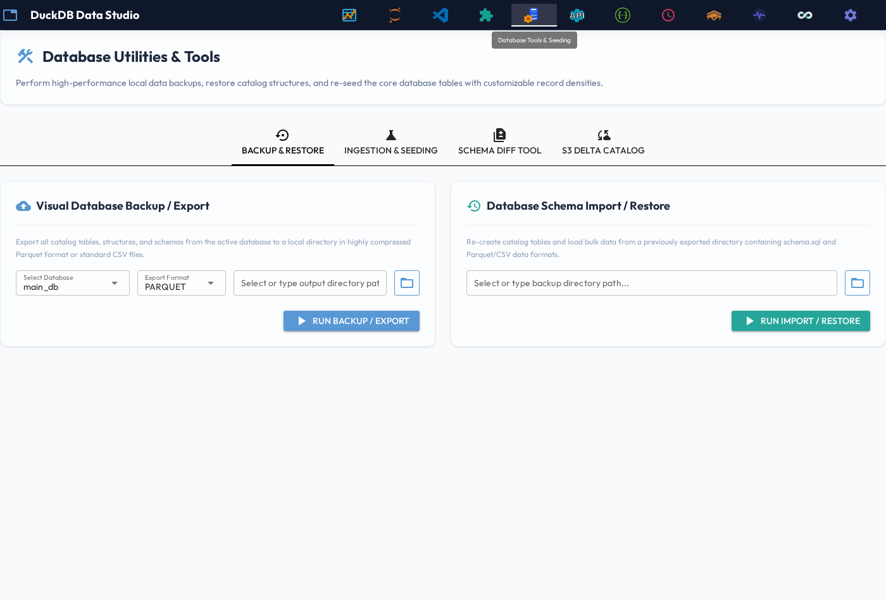
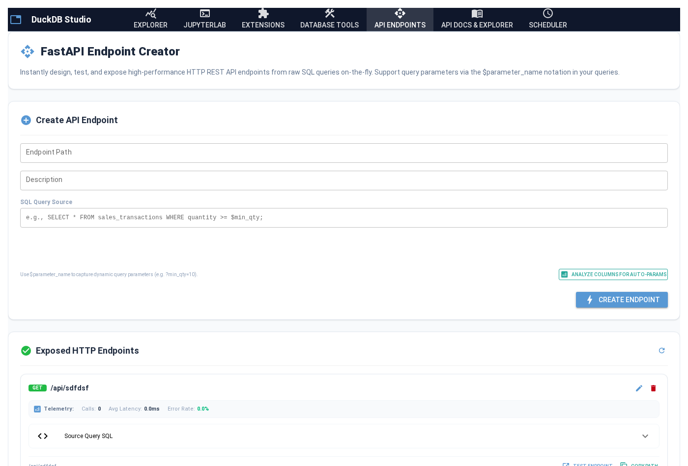
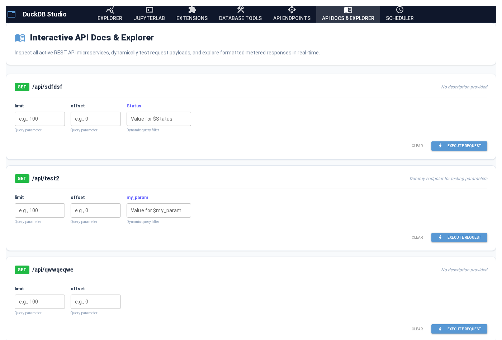

# 📖 DuckDB Studio & API Explorer Manual

Welcome to the official, complete user manual for **DuckDB Studio & API Explorer**. This document covers every screen, utility, and dynamic capability built into the application. It highlights all the latest system optimizations, permission fixes, and new features.

---

## 🚀 Live Studio Feature Traversal Walkthrough

Below is a live, automated walk-through demonstrating rapid traversal across all workspace tabs inside **DuckDB Studio** in real-time, showing the modernized interface:


---

## 🧭 Workspace Navigation Overview

DuckDB Studio organizes its workspaces into specialized tabs:

| Workspace Tab | Icon | Purpose |
| :--- | :---: | :--- |
| **[1. Explorer](#1-explorer)** | `query_stats` | Database schema catalog browser, visual query builder, AI SQL Copilot, and SQL editor. |
| **[2. JupyterLab](#2-jupyterlab)** | `terminal` | Embedded JupyterLab notebook interface running on system python with `duckrun` integration. |
| **[3. dbt Code Server](#3-dbt-code-server)** | `vscode_blue` | Integrated VS Code editor environment pre-configured for dbt model development. |
| **[4. Extensions](#4-extensions)** | `extension` | Graphical extension installer/loader for DuckDB's runtime libraries (spatial, httpfs, etc.). |
| **[5. Database Tools](#5-database-tools)** | `construction` | Data migration utilities including backup, structure restore, CSV/Parquet import, and scaling data seeders. |
| **[6. API Endpoints](#6-api-endpoints)** | `api` | SQL-to-REST API creator, dynamic auto-parameter parser, JWT security controls, and telemetry dashboard. |
| **[7. API Docs & Explorer](#7-api-docs--explorer)** | `menu_book` | OpenAPI interactive Swagger interface and dynamic testing sandbox. |
| **[8. Scheduler](#8-scheduler)** | `schedule` | Automated query scheduler, folder exporter, and telemetry logs retention clean-up agent. |
| **[9. Settings](#9-settings)** | `settings` | Global system settings and credentials manager. |
| **[10. Apache Superset](#10-apache-superset)** | `bar_chart` | Integrated enterprise BI reporting dashboard with PGWire connections. |
| **[11. MCP Server](#11-model-context-protocol-mcp-server)** | `hub` | Built-in Model Context Protocol (MCP) server for external AI assistant integration. |

---

## 🛠️ Detailed Screen-by-Screen Walkthrough

### 1. Explorer

The core SQL IDE of DuckDB Studio. It features a dual-column layout dividing the database metadata tree and active SQL editor workspace.



#### Live Explorer Walkthrough:
Below is a walk-through demonstrating database schema catalog browser traversal, visual query building, and sql query execution:


#### Key Capabilities:
* **Ad-Hoc Editor**: Write standard or complex SQL statements with hot-reloaded autocomplete and execute them using `Ctrl + Enter` or the **Run Query** button.
* **Database Catalog Tree**: Visually trace attached databases (`main_db`, `car_rental`, `e_commerce`, `logistics`, `ducklake`, `s3_delta_catalog`), schemas, tables, views, columns, and data types. Click any table node to automatically preview its data.
* **Visual Query Builder**: Build projection queries dynamically by checking columns, configuring sort options (`ASC`/`DESC`), and adding filter clauses in the UI.
* **Output Results Views**:
  * **Data Grid**: High-performance interactive data table with pagination, CSV export, and Parquet export.
  * **Analytics Chart**: Visual chart renderer supporting Bar, Line, and Pie chart types.
  * **Geo Map**: Integrated Leaflet map visualization for spatial and coordinate (`latitude`/`longitude`) dataset plotting.
  * **Query Profiler**: Graphical query execution timing and node breakdown.
  * **Session History**: Historical trace of query metrics and execution speeds.
  * **System Log**: Real-time console diagnostics and error stack traces.
* **Save Presets**: Save SQL queries directly into internal storage. Saved queries can be loaded back into the editor with one click.
* **Execution Plan Visualizer**: Run logical and physical optimizer tracing via **Explain Plan** or trace dynamic execution profiling with **Explain Analyze**.

#### 🤖 AI SQL Copilot & Autonomous Execution System:
The AI SQL Copilot is an embedded AI pair programmer available directly inside the Explorer workspace.

* **1-Click Execution Buttons**: Generated SQL code blocks include **`▶ Run Query`** (executes instantly in SQL Workspace), **`↗ To Editor`** (copies to editor for manual edits), and **`📋 Copy`** (copies to clipboard).
* **Autonomous Auto-Run Mode**: Toggle **`🟡 Auto-Run`** in the Copilot header to automatically execute generated SQL queries, format a 5-row markdown sample preview table inside the chat bubble, and populate the main Data Grid.
* **Self-Healing Auto-Fix Loop**: When Auto-Run is enabled, if DuckDB returns an execution error, Copilot automatically catches the exception, generates a corrected query, and executes the fix seamlessly.
* **Multi-Database & Cross-Database JOINs**: Copilot receives schema context for all attached databases (`main_db`, `car_rental`, `e_commerce`, `logistics`, `ducklake`, `s3_delta_catalog`) and strictly enforces fully-qualified `<database>.<schema>.<table>` syntax.
* **Wide Full-Width Chat UI**: Features a 440px wide panel with 100% horizontal text bubble width and zero avatar margin bloat.

#### Latest Features & Optimizations:
* **AI SQL Copilot & CPU-Bound Local LLM Guide**: Supports both cloud providers and 100% offline local CPU models. Small quantized models (`qwen2.5-coder:1.5b` or `3b`) run at **25–70 tokens/sec on CPU RAM**, enabling ultra-fast local query generation, 1-click execution, and self-healing auto-fix loops without a GPU.
* **S3 Delta Tables Catalog Sync**: On container startup and every 60 seconds in the background, S3 Delta table formats in the target bucket (`devbucket`) are automatically scanned and registered as views inside the database `main_db` in schema `s3_delta_catalog`.
* **HTTP Keep-Alive & Metadata Cache**: Every database connection is optimized with socket reuse (`http_keep_alive = true`), Parquet footer metadata memory caching (`enable_object_cache = true`), and socket timeouts (`http_timeout = 10`) to speed up S3/OneLake Delta reads and fail fast on network drops.

##### 🤖 CPU-Bound Local LLM Setup Guide:

If you do not have a dedicated GPU or want a zero-cost local LLM setup, modern small code-specialized models running on standard CPU RAM provide full Copilot functionality.

###### ⚡ Recommended CPU Models (Quantized GGUF Q4_K_M):

| Model Name | RAM / Footprint | CPU Speed | SQL Accuracy | Best For |
|---|---|---|---|---|
| **`qwen2.5-coder:1.5b`** | **~1.2 GB RAM** | 🚀 **40–70 tokens/sec** | ⭐⭐⭐⭐ (90%+) | **Ultra-fast CPU execution**, lowest memory footprint |
| **`qwen2.5-coder:3b`** | **~2.2 GB RAM** | ⚡ **25–45 tokens/sec** | ⭐⭐⭐⭐⭐ (95%+) | **Best balance** of speed & high SQL accuracy |
| **`deepseek-coder:1.5b`** | **~1.3 GB RAM** | 🚀 **35–60 tokens/sec** | ⭐⭐⭐⭐ (88%+) | Lightweight coding model |
| **`llama3.2:3b-instruct`** | **~2.0 GB RAM** | ⚡ **25–40 tokens/sec** | ⭐⭐⭐⭐ (85%+) | General instruction following |

###### 🛠️ Setting Up a CPU Local LLM with Ollama:

1. **Install and run Ollama on your host system**:
   ```bash
   ollama run qwen2.5-coder:1.5b
   # OR for higher accuracy:
   ollama run qwen2.5-coder:3b
   ```

2. **Configure DuckDB Studio**:
   * Open the **Settings** tab in the top navigation bar.
   * Set **AI Provider**: `Ollama` (or `Custom / OpenAI-Compatible`).
   * Set **Base URL**: `http://host.docker.internal:11434/v1` (or `http://10.0.2.2:11434/v1` for Linux Rootless Docker).
   * Set **Model Name**: `qwen2.5-coder:1.5b` or `qwen2.5-coder:3b`.
   * Click **Save AI Settings**.

Because SQL queries are concise (50–200 tokens), a 1.5B or 3B model running on CPU generates and auto-executes queries in **1 to 3 seconds**.

---

### 2. JupyterLab

An integrated interactive data science environment running on the host system python environment.



#### Live JupyterLab Walkthrough:


#### Python & Pandas Data Science:
* **Notebooks**: Launch Jupyter notebook kernels to write advanced Python code alongside your DuckDB instance.
* **`duckrun` Integration**: Utilize `duckrun` inside notebooks to query Delta tables on S3 storage.
* **Local Dataframe Queries**: Register Pandas DataFrames directly in the underlying database catalog using `conn.con.register("name", df)`.
* **S3 Secret Provisioning**: S3 credentials can be configured natively inside the notebook connection:
  ```python
  import duckrun
  conn = duckrun.connect()
  conn.con.execute("CREATE SECRET (TYPE S3, KEY_ID '...', SECRET '...', ENDPOINT 'garage:3900', USE_SSL false, URL_STYLE 'path')")
  ```

---

### 3. dbt Code Server

An embedded full-featured VS Code IDE server (`dbt-code-server` container running on port `8443` and routed through `editor.localhost:8880`), custom-tailored for dbt (data build tool) development against DuckDB/S3 Delta table catalogs.



#### Integrated dbt Development Workflow:
This tab exposes the complete `dbt_project/` workspace folder, enabling developers to build, compile, and document modular SQL models out-of-the-box.
* **dbt-core Engine**: The container has `dbt-core` and the `dbt-duckrun` adapter installed natively.
* **dbt Power User Integration**: Pre-loaded with the **dbt Power User** extension (`innoverio.vscode-dbt-power-user`), providing:
  * **Model Compilation & Running**: Compile models on-the-fly (`Ctrl + '`) and run individual queries directly inside the workspace view.
  * **Lineage & Dependency Trees**: Generates visual dependency graphs mapping relationships between your staging, intermediate, and dimensional models.
  * **Interactive Code Autocomplete**: Auto-completes dbt Jinja macros such as `ref()`, `source()`, and `config()`.
* **Automatic sqlfmt Formatting**: Configured to use the system-installed `shandy-sqlfmt[jinjafmt]` formatter. Whenever a Jinja-SQL file is saved, it is automatically formatted according to the pre-configured workspace rules (`.vscode/settings.json` default formatting engine).
* **Delta Lake on Garage S3 Storage**: Models compiled and run via the `s3_delta` target (using the `dbt-duckrun` adapter) are written and stored directly as **Delta Lake tables** inside the local **Garage S3** cluster (`s3://devbucket/tables/`).
  * **Directory Structure**: Stored in standard Delta directory format (Parquet data segments accompanied by a transaction log folder `_delta_log/`).
  * **Catalog Auto-Discovery**: When dbt builds these tables, the application's periodic background sync task automatically registers them as views inside the database `main_db` in schema `s3_delta_catalog`, making them queryable instantly from the Explorer tab without manual intervention.

#### Robust Compatibility Workarounds (Included):
* **Self-Healing Ownership**: Automatically runs a recursive `chown` to assign workspace files to the container's unprivileged user (`coder` UID `1000`) and a `chmod` to grant world-write access, resolving rootless Docker permission conflicts on startup.
* **Python 3.13 Serialization Fix**: Includes an automatic startup patch that overrides the extension's JSON encoder, preventing compilation crashes caused by thread lock serialization changes on Python 3.13.

---

### 4. Extensions

A visual manager for DuckDB's runtime plugins, enabling one-click library installation and loading.



#### Functions:
* **Extension Grid**: Visual status cards for extensions (`httpfs`, `postgres_scanner`, `sqlite_scanner`, `spatial`, `icu`, `json`, `ducklake`).
* **Interactive Badges**: Color indicators showing whether an extension is **Installed** (Grey) or **Loaded** (Green).
* **Actions**: Click **Install** to pull the binary directly from DuckDB's servers, and **Load** to initialize it into the active execution connection.

---

### 5. Database Tools

A backup, restore, file importer, and scalability benchmarker for DuckDB databases.



#### Capabilities:
* **CSV/Parquet File Importing**: Use the file picker to import CSV, JSON, or Parquet files directly from your workspace directory into your active database catalog.
* **Catalog Backup & Restore**: Export the structural database catalog into recovery SQL files and execute them to restore schemas, tables, and views structure.
* **Scalability Seeding**: Move the record density slider from `100` to `100,000` rows and click **Trigger Seed Generation** to populate test tables, allowing you to validate performance metrics under realistic data scale.

---

### 6. API Endpoints

Turn any SQL select query into an active REST API microservice and monitor live metrics.



#### Live API Endpoints Walkthrough:


#### Dynamic REST APIs:
* **Auto-Generated Query Parameters**: Use the `$parameter_name` notation to automatically capture dynamic query parameters from incoming requests (e.g. `?min_qty=10`).
* **Column Analysis Filter Creator**: Under the SQL editor, click **Analyze Columns for Auto-Params** to parse the schema of your target database table and auto-generate parameter logic based on dynamic ranges.
* **API Route Listing**: View all registered endpoints at `/api/list-endpoints` before catch-all wildcards hijack paths.

#### Security & Auth:
* **JWT Authentication Toggle**: Enable or disable JWT verification on-the-fly. When enabled, requests require passing the Bearer token in the header (`Authorization: Bearer <token>`), verified using `HS256` symmetric signing with the global `STORAGE_SECRET`.

#### High-Performance Streaming:
* **NDJSON Streaming**: Append `/stream` to any endpoint URL (e.g. `/api/orders/stream`) to stream massive datasets row-by-row in Newline Delimited JSON (`application/x-ndjson`) using HTTP chunked transfer encoding, maintaining a flat memory footprint.

#### Rate Limiting & Throttling:
* **SlowAPI Integration**: Define specific request throttle limits per endpoint (e.g. `10/minute`, `100/hour`) to prevent server overload.

#### Telemetry Dashboard:
* Monitor overall KPI metrics (Total requests, average response speeds, success rates) and audit detailed routes logs (Min/Max Latency, Success Ratios, and Trigger times) directly.

---

### 7. API Docs & Explorer

An embedded Swagger-style sandbox to document and run loops against dynamic APIs.



#### Live API Docs Walkthrough:


#### Interactive Docs Sandbox:
* **Interactive Sandbox**: Auto-detects endpoint parameters and generates input forms inside the UI.
* **JWT Testing Sandbox**: Paste authorization tokens into the token field to test secured endpoints directly.
* **Loopback Executor**: Executes requests via internal HTTP loops, measuring request latency, status codes, and absolute URLs.
* **Formatted JSON View**: Renders dynamic query results as formatted syntax-highlighted JSON trees.

---

### 8. Scheduler

Automate your query reporting and data extraction pipelines.


#### Live Scheduler Walkthrough:


#### Job Automation:
* **Preset Loader**: Pull queries from Saved Queries into the form with one click.
* **Interval Scheduler**: Configure intervals (`Every Minute`, `Every Hour`, `Daily`, etc.) to trigger background tasks.
* **Export Configurations**: Select Parquet, CSV, or JSON formats. Type in a partition column (e.g. `category`) to partition the folder natively using DuckDB's fast `PARTITION_BY` system.
* **Automation Grid**: Toggle job statuses, manually run queries instantly with visual toast notifications, and trace rows/file sizes inside the execution logs history grid.

#### Periodic Telemetry Cleanup (New Optimization):
* An hourly background task cleans up SQLite logs to keep the config database size small. It automatically prunes:
  * API metrics (`_duckdb_studio_api_metrics`) older than 7 days.
  * Scheduler run logs (`_duckdb_studio_scheduler_logs`) older than 7 days.
  * SQL console execution history (`_duckdb_studio_query_history`) older than 7 days.

---

### 9. Settings

A centralized control panel to manage global application parameters, safety overrides, telemetry settings, security keys, and external notebook credentials.

#### Configurations:
* **Rate Limiting & Safety Limits**: Configure default rate limits, maximum query row returns, and default pagination page sizes.
* **Security & JWT**: Customizes JWT signature secrets, issuer names, and audiences.
* **Telemetry Config**: Set retention duration for database telemetry metrics.
* **Jupyter Credentials**: Configure the Jupyter server URL and token.

---

### 10. Apache Superset BI Workspace

Integrated enterprise business intelligence reporting workspace built into DuckDB Data Studio.

#### Integration Details:
* **Embedded UI**: Accessible directly from the top navigation bar iframe tab or via `http://studio.localhost:8880/superset/`.
* **PGWire Connectivity**: Connected to DuckDB Data Studio via the embedded **Buena Vista / Duckgres** Postgres Wire Protocol server running on port `5433`.
* **Pre-Configured Datasources**: Pre-connected to DuckDB catalogs with persistent Postgres driver hooks (`psycopg2`), enabling instant chart creation, dashboards, and slice-and-dice analytics.

---

### 11. Model Context Protocol (MCP) Server

DuckDB Data Studio includes an embedded **Model Context Protocol (MCP)** server, enabling external AI coding assistants (such as Antigravity, Claude Desktop, Cursor, or VS Code Copilot) to programmatically interact with your workspace.

#### 🧰 Available MCP Tools:

| Tool Name | Purpose | Parameters |
|---|---|---|
| **`execute_sql`** | Executes any DuckDB SQL query and returns formatted markdown tables. | `sql` |
| **`list_databases_and_tables`** | Returns a complete tree breakdown of all attached databases, schemas, tables, and column types. | *None* |
| **`describe_table`** | Returns column metadata, data types, nullability, and total row count for a table. | `database_name`, `table_name`, `schema_name` |
| **`export_query_results`** | Exports query results to Parquet, CSV, or JSON files. | `sql`, `file_path`, `file_format` |
| **`attach_database`** | Dynamically attaches a DuckDB or SQLite database file. | `database_name`, `file_path`, `read_only` |
| **`explain_query`** | Generates physical execution plans (`EXPLAIN` / `EXPLAIN ANALYZE`). | `sql`, `analyze` |
| **`get_query_history`** | Retrieves recent SQL query execution history, durations, and row counts. | `limit` |
| **`run_dbt_model`** | Triggers a `dbt-duckrun` model build execution in the workspace container. | `model_name` |
| **`get_system_info`** | Returns DuckDB engine version and all attached database storage paths. | *None* |

#### 💻 Connection Specifications:
* **HTTP SSE Endpoint**: `http://localhost:8086/mcp/sse` (or `http://studio.localhost:8880/mcp/sse`)
* **Standalone Stdio Script**: `python3 /app/mcp_server_duckdb.py`

#### Client Configuration Templates:
* **Antigravity / Gemini CLI**: Pre-configured in [`config/mcp_config.json`](../config/mcp_config.json).
* **VS Code & Cursor**: Pre-configured in [`.vscode/mcp.json`](../.vscode/mcp.json).
* **Claude Desktop**: Template in [`config/claude_desktop_config.json`](../config/claude_desktop_config.json).
