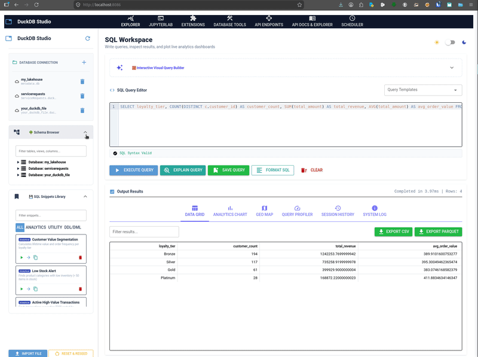
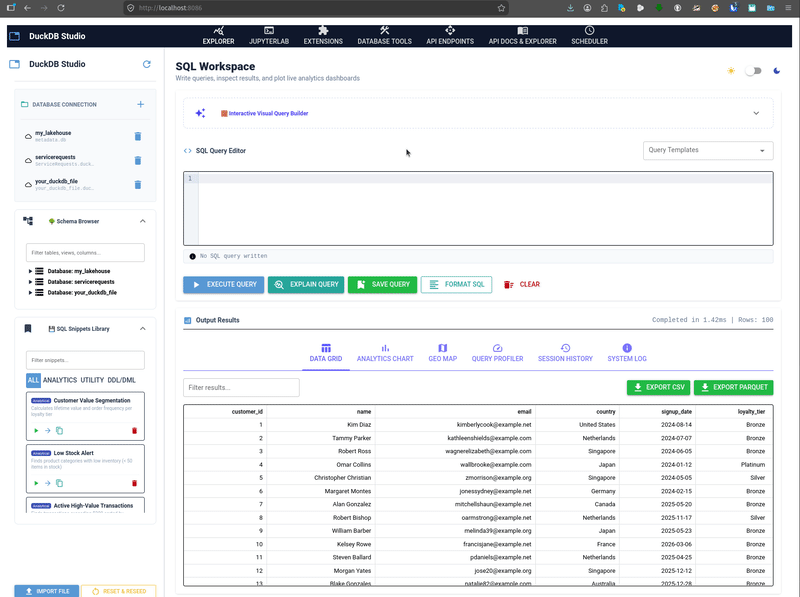
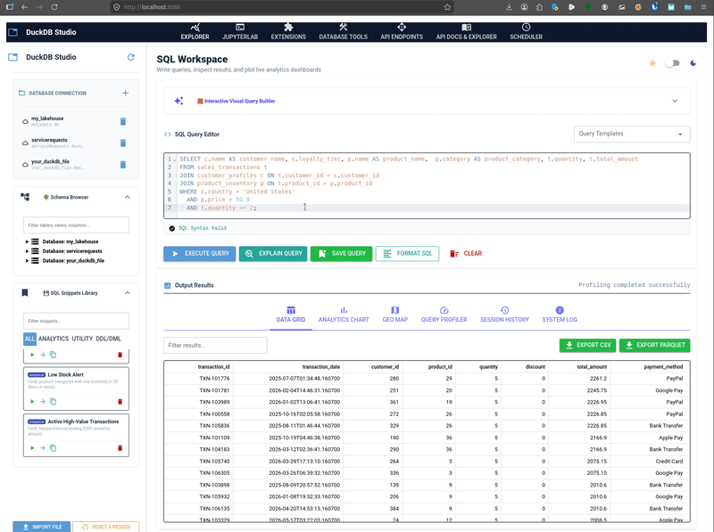
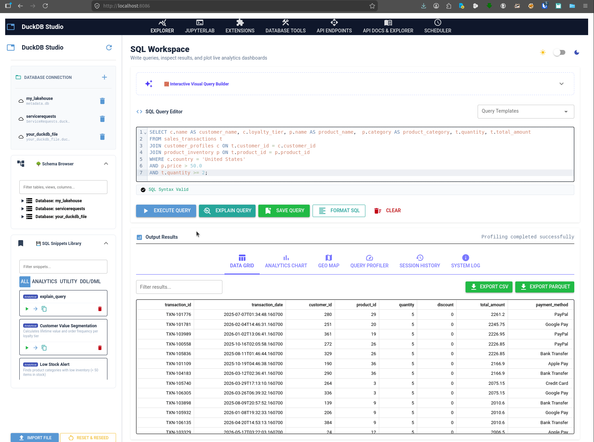
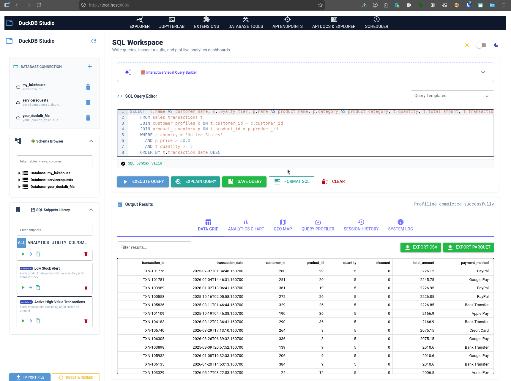
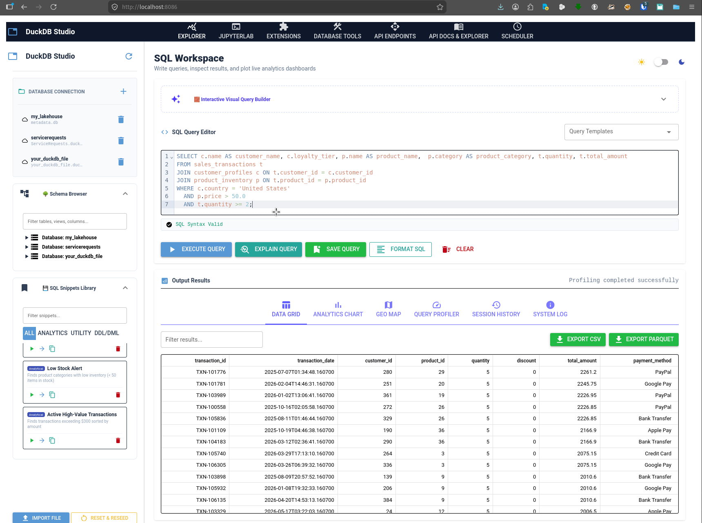
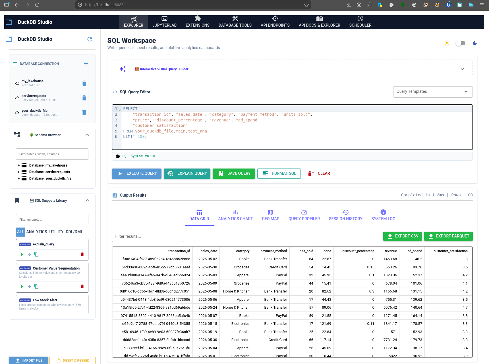
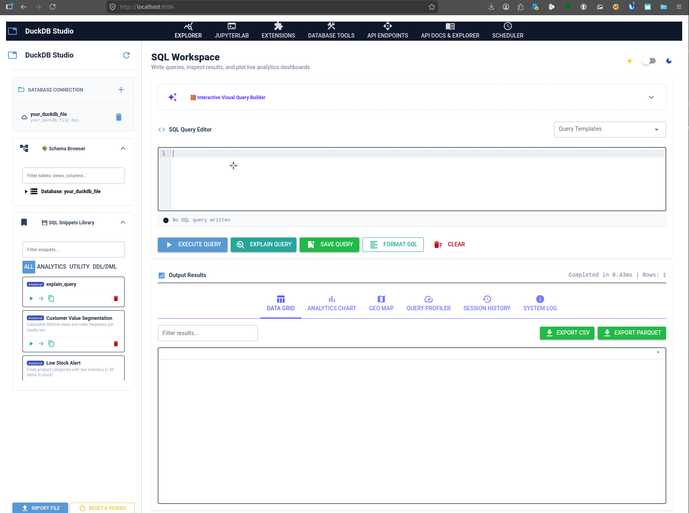
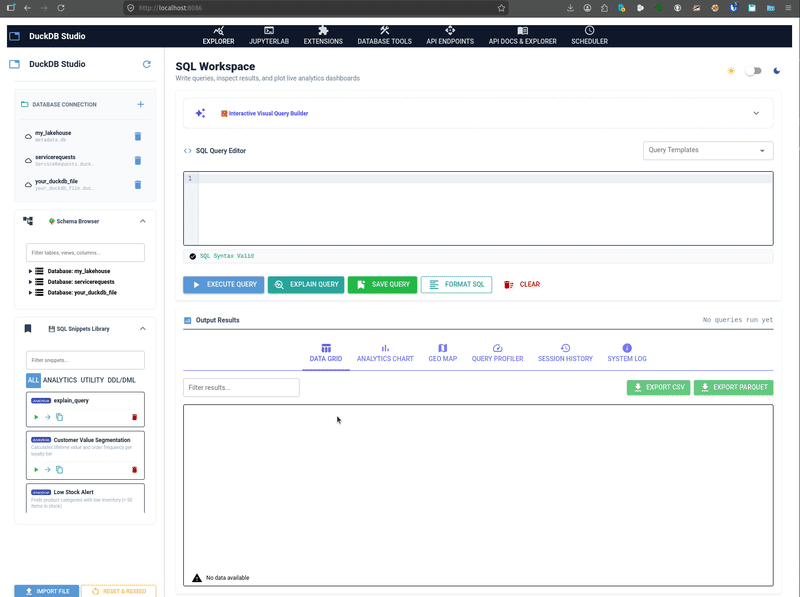

# 📖 DuckDB Studio & API Explorer Manual

Welcome to the official, complete user manual for **DuckDB Studio & API Explorer**. This document covers every single screen, utility, and dynamic capability built into the application, complete with live pixel-perfect screenshots and high-fidelity animated walkthroughs captured directly from the local running server environment.

---

## 🚀 Live Studio Feature Traversal Walkthrough

Below is a live, automated walk-through demonstrating rapid traversal across all 7 workspace tabs inside **DuckDB Studio** in real-time:


---

## 🧭 Navigating the Workspace Tabs

DuckDB Studio organizes its toolset into specialized workspace tabs:

| Workspace Tab | Icon | Purpose |
| :--- | :---: | :--- |
| [1. Explorer](#1-explorer) | `query_stats` | Database schema catalog, visual column structure query builder, and ad-hoc SQL console. |
| [2. JupyterLab](#2-jupyterlab) | `terminal` | Embedded Jupyter console terminal for writing integrated Python and pandas data science notebooks. |
| [3. Extensions](#3-extensions) | `extension` | Graphical DuckDB extension repository enabling one-click library installation and loading. |
| [4. Database Tools](#4-database-tools) | `construction` | Utility workshop containing database schema backups, schema restores, and test data seeding routines. |
| [5. API Endpoints](#5-api-endpoints) | `api` | Dynamic REST API creator, custom parameter binders, and live endpoints manager with optional JWT protection. |
| [6. API Docs & Explorer](#6-api-docs--explorer) | `menu_book` | OpenAPI interactive Swagger playground and Loopback testing sandbox supporting Bearer Auth. |
| [7. Scheduler](#7-scheduler) | `schedule` | Background automation query scheduler, Parquet/CSV exporter, and telemetry logs. |
| [8. Settings](#8-settings) | `settings` | Global system configurations page for rate limits, pagination, security credentials, and JupyterLab tokens. |

---

## 🛠️ Comprehensive Screen-by-Screen Walkthroughs

### 1. Explorer

The core IDE of DuckDB Studio. It features a dual-column layout dividing the database metadata tree and active SQL editor workspace.

#### Active Explorer Screen:


#### Live Explorer Feature Traversal Walkthrough:


#### Advanced Explorer Visual Assets:

#### Schema Catalog Browser
Easily browse through your databases, schemas, tables, views, and columns recursively:



#### Interactive Visual Query Builder
Build database projection queries dynamically on-the-fly without typing single line of SQL:



#### Save Query Presets
Save your frequently used SQL scripts directly to internal DuckDB storage for quick loading later:



#### Session History Trace
Trace and review recently run query metrics, timing, and latencies:



#### Explain Plan
Visually analyze the execution query optimization plan (logical, physical, and execution profile statistics):



#### Explain Analyze Plan
Visually trace dynamic execution timing and profile statistics inside the catalog:



#### Functions:
* **Ad-Hoc Editor**: Write standard or complex SQL statements with hot-reloaded autocomplete and execute them using `Ctrl + Enter`.
* **Database Catalog Tree**: Visually trace attached databases, schemas, tables, views, columns, and data types. Click any table node to automatically preview its data inside the query terminal!
* **Visual Query Builder**: Build projections dynamically by checking columns, configuring sort columns (`ASC`/`DESC`), and injecting filter clauses without typing raw SQL.
* **History Trace**: Access recently executed commands with runtime latencies to quickly restore a previous state.

---

### 2. JupyterLab

An integrated interactive data science console.

#### Active JupyterLab Screen:


#### Active JupyterLab Walkthrough:


#### Functions:
* **Python Notebooks**: Launch Jupyter notebook kernels to write advanced Python code alongside your DuckDB instance.
* **Pandas Scans**: Direct loopbacks inside notebooks to read from the DuckDB local catalogs:
  ```python
  import duckdb
  df = duckdb.query("SELECT * FROM product_inventory").df()
  ```

---

### 3. Extensions

A visual manager for DuckDB's unique runtime plugins.

#### Active Extensions Manager Walkthrough:


#### Functions:
* **Extension Grid**: Visual status cards for extensions (`httpfs`, `postgres_scanner`, `sqlite_scanner`, `spatial`, `icu`, `json`).
* **Interactive Badges**: Beautiful color indicators showing whether an extension is **Installed** (Grey) or **Loaded** (Green).
* **One-Click Actions**: Click **Install** to pull the binary directly from DuckDB's servers, and **Load** to initialize it into the active execution connection.

---

### 4. Database Tools

A backup, restore, and scalability benchmarker for DuckDB local databases.

#### Active Database Tools Walkthrough:


#### Direct File Importing Walkthrough:
Easily import CSV/Parquet files directly into your active catalog using the file selector interface:



#### Functions:
* **Backup Utilities**: Export the structural database catalog into clean SQL recovery files.
* **Restore Catalog**: Execute a selected backup SQL file to instantly restore schemas, tables, and views structure.
* **Scalability Seeding**: Move the record density slider from `100` to `100,000` rows and click **Trigger Seed Generation** to populate test tables, allowing you to validate performance metrics under realistic data scale.

---

### 5. API Endpoints

Turn any SQL select query into an active REST API microservice and monitor live metrics.

#### Active API Endpoints Workspace:


#### Active API Endpoints Workspace Walkthrough:


#### Optional JWT Authentication:
Dynamic API endpoints can optionally require secure JWT (JSON Web Token) Authorization.
* **Toggle Security**: Enable or disable authentication on-the-fly using the **Require JWT Token Authorization** toggle switch during endpoint creation or editing.
* **Header Enforced**: When protected, the endpoint rejects unauthorized requests with a `401 Unauthorized` response. Accessing the endpoint requires passing the Authorization header:
  ```http
  Authorization: Bearer <your_jwt_token>
  ```
* **Signature Verification**: Signature verification is performed on the server using `HS256` symmetric signing with the global `STORAGE_SECRET`.

#### High-Performance NDJSON Streaming:
To safely retrieve massive datasets (up to 1,000,000+ records) without memory ballooning or timeouts, you can stream queries:
* **Route Path**: Simply append `/stream` to any endpoint URL (e.g. `/api/books/stream`).
* **Format**: Streams data row-by-row in Newline Delimited JSON (`application/x-ndjson`) using HTTP chunked transfer encoding, maintaining a constant flat memory footprint.

#### API Request Metering (Rate Limiting):
To protect endpoints against spam or Denial-of-Service, dynamic request throttling is enforced using `slowapi`:
* **Configurable Rate Limits**: Each endpoint can define its own rate limit (e.g. `10/minute`, `100/hour`).
* **Default Fallback**: If no specific rate limit is defined on an endpoint, the system defaults to a default limit (e.g. `5/minute`). This default is globally configurable.
* **Over-Limit Response**: Exceeding rate limits instantly halts request processing and returns an `HTTP 429 Too Many Requests` code with a structured error payload.

#### Functions:
* **Form Compiler**: Specify an endpoint slug (e.g. `recent-sales`) and write a query.
* **Auto-Generated Query Parameters**: Use the `$parameter_name` notation to automatically capture dynamic query parameters from incoming requests (e.g. `?min_qty=10`).
* **Column Analysis Filter Creator**: Under the editor, click **Analyze Columns for Auto-Params** to parse the schema of your target database table and auto-generate parameter logic based on dynamic ranges.
* **Safe Metered API Pagination**: Dynamic pagination enforcing a default limit of 100 records and a safety ceiling of 10,000, automatically wrapping unbounded queries.
* **Live Telemetry & Performance Dashboard**: Read overall KPI metrics (Total requests, average response speeds, success rates) and audit detailed routes logs (Min/Max Latency, Success Ratios, and Trigger times) directly.

---

### 6. API Docs & Explorer

An embedded Swagger-style sandbox to document and run loops against dynamic APIs.

#### Active Interactive Docs Sandbox:


#### Active API Docs & Explorer Walkthrough:


#### Functions:
* **Interactive Sandbox**: Auto-detects endpoint parameters and generates input forms inside the UI.
* **JWT Testing Sandbox**: If an API requires JWT Authorization, a dedicated **Authorization Token** field is automatically rendered, allowing you to paste a Bearer token and test secured endpoints directly.
* **Loopback Executor**: Executes requests via internal HTTP loops, measuring request latency, status codes, and absolute URLs.
* **Formatted JSON View**: Renders dynamic query results as formatted syntax-highlighted JSON trees.

---

### 7. Scheduler

Automate your query reporting and data extraction pipelines.

#### Active Query Scheduler Screen:


#### Active Query Scheduler Walkthrough:


#### Functions:
* **Preset Loader**: Automatically pull final query SQL from Saved Queries into the form with one click.
* **Scheduler Worker**: Configure intervals (`Every Minute`, `Every 5 Minutes`, `Every 15 Minutes`, `Every Hour`, `Every 12 Hours`, `Daily`) which trigger background tasks to dump results into `/exports/`.
* **Export Configurations**: Select Parquet, CSV, or JSON formats. Type in a partition column (e.g. `category`) to partition the folder natively using DuckDB's fast `PARTITION_BY` system.
* **Automation Grid**: Toggle job statuses (Active/Inactive), manually run queries instantly with visual toast notifications, and trace rows/file sizes (e.g., `120.4 KB`) inside the execution logs history grid.

---

### 8. Settings

A centralized control panel to manage global application parameters, safety overrides, telemetry settings, security keys, and external notebook credentials. All changes are stored back to the YAML configuration file (`config/studio_config.yaml`) and take effect immediately.

#### Functions & Configurable Items:
* **Rate Limiting & Safety Limits**:
  * **Default Endpoint Rate Limit**: Configures the fallback limit applied to dynamic endpoints when no per-endpoint override is defined (defaults to `5/minute`).
  * **Maximum Safety Limit (Rows)**: Restricts the absolute maximum number of rows returned in standard API JSON requests to prevent memory inflation.
  * **Default Page Size**: Controls default pagination bounds for dynamic endpoints.
* **Security & JWT tokens**:
  * **JWT Signature Secret**: Customizes the key used for HMAC HS256 validation.
  * **JWT Issuer Name & Audience**: Standardized properties to strictly parse client identity.
* **Telemetry Configuration**:
  * **Telemetry Retention (Days)**: Specifies the duration for maintaining API access counts and latencies before automatic cleanup.
* **JupyterLab Credentials**:
  * **Jupyter Server URL & Security Token**: Credentials used to render the embedded notebook console tab safely.
