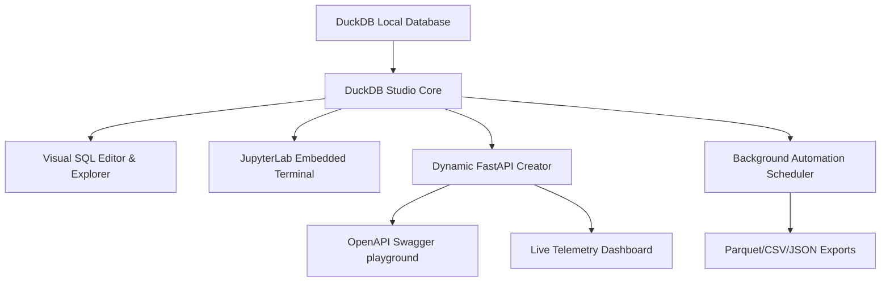

# 🦆 DuckDB Studio & API Explorer

**DuckDB Studio & API Explorer** is a high-performance visual IDE, microservice compiler, and automated background data pipeline manager designed specifically for **DuckDB**. It acts as a bridge between high-performance local database exploration and cloud-native microservice deployment. 

With DuckDB Studio, you can seamlessly write ad-hoc analytical SQL queries, instantly wrap them as FastAPI dynamic endpoints with auto-parsed query parameters, run cron-based ETL exports directly to Parquet or partitioned directories in the background, and monitor active request health and speeds using an integrated live telemetry dashboard.

---

## 💡 The Value Proposition & Developer Pain Points Solved

Traditional analytical workflows are highly fragmented:
1. **Ad-Hoc Querying**: Developers run local SQL terminals or standalone scripts to analyze data.
2. **REST API Generation**: Once the query is finalized, developers must write boilerplate code in FastAPI, Flask, or Express, configure request parameter bindings, set up security sanitization, and manage response limits.
3. **Background ETL**: Automating reports requires configuring external schedulers (e.g. cron, Airflow, or Celery) and writing complex export functions.
4. **Telemetry Logging**: Setting up metrics tables, logging speeds, and tracking endpoint errors is an afterthought that takes significant setup time.

**DuckDB Studio solves all of this under a single unified dashboard**. It is the ultimate productivity suite for developers, data scientists, and analysts who want to turn local DuckDB databases into fully managed backend services in seconds.

---

## 🚀 Key Architectural Pillars & Feature Set



### 1. Visual SQL Editor & Interactive Catalog Explorer 📊
* **High-Performance Query Execution**: Execute complex analytical SQL queries instantly against local or attached databases with NiceGUI's premium responsive layout.
* **Schema Catalog Tree**: Visually browse schemas, tables, views, columns, and datatype catalogs via an interactive sidebar list, allowing fast discovery of database structures.
* **Execution History & Snippets**: Retain a robust history of executed statements and save frequently used queries into a custom workspace library to easily rebuild your analysis pipelines.

### 2. Embedded JupyterLab Workspace 💻
* Embedded full-featured **JupyterLab** workspace terminal enabling seamless integration with notebooks for advanced Python, pandas, and machine learning pipelines side-by-side with your database operations.

### 3. Visual Extensions Manager 🔌
* Browse the rich DuckDB extension catalog (like `httpfs` for S3 query structures, `postgres_scanner`/`sqlite_scanner` for direct database scanners, `spatial`, and `icu`).
* Visually click to **Install** and **Load** extensions in real-time without writing manual SQL commands.

### 4. Database Seeding & Recovery Utilities 🛠️
* **Catalog Backups & Restore**: Create instant catalog structure backups and restore them in one click.
* **Custom Database Seeding**: Populate benchmark tables with custom-density test datasets in seconds to validate query architectures under scale.

### 5. FastAPI Endpoint Creator (Microservices Generator) ⚡
* **Instant Expose**: Compile any raw SQL query on-the-fly and host it as a dynamic REST API endpoint (e.g. `/api/recent-sales`).
* **Auto-Generated Query Parameters**: Use the `$parameter_name` notation to automatically capture dynamic query parameters from incoming requests (e.g. `?min_qty=10`). Includes custom analysis tools to parse table schemas and auto-generate parameter options.
* **Safe Metered API Pagination**: Avoid container crashes from massive responses. Enforces a default dynamic pagination limit of 100 records and a safety max limit ceiling of 10,000, automatically wrapping unbounded queries.

### 6. Interactive OpenAPI Docs & Explorer 📖
* Embedded visual sandbox playground designed in a modern Swagger UI layout.
* Inspect active dynamic endpoint schemas, input query parameters, test executions with real-time browser loopbacks, and view beautifully formatted JSON response blocks with live latency measurements.

### 7. Live API Metrics & Latency Dashboard 📈
* **KPI Telemetry Cards**: Monitor global health statistics, including Total API Requests, Average Latency (ms), and Global Success Rate percentage.
* **Granular Route Analytics**: Review a performance analytics table sorting endpoint routes by invocations, average response times, min/max bounds, success ratios, and last triggered timestamps.
* **Reset Operations**: Instantly truncate metrics log history to start fresh profiling sessions.

### 8. Background Query Scheduler & Exporter ⏰
* **Automated Data Pipelines**: Build period-based schedules (`Every Minute` to `Daily`) to automatically execute saved queries in a background thread.
* **High-Performance Exports**: Dump scheduled query results directly to the project's local `/exports/` directory as **Parquet**, **CSV**, or **JSON** files.
* **Native Partitioning**: Specify optional columns to partition the exported directories natively using DuckDB's ultra-fast `PARTITION_BY` option.
* **Automation Grid**: Manage automation profiles with interactive pause/resume toggles, manual trigger buttons, and visual execution log tables.

---

## 🛠️ Technology Stack & Dependencies

* **Frontend Framework**: [NiceGUI](https://nicegui.io/) (High-performance web interface builder based on TailwindCSS and Quasar)
* **Backend Framework**: [FastAPI](https://fastapi.tiangolo.com/) (Asynchronous high-performance REST API routing)
* **Database Engine**: [DuckDB](https://duckdb.org/) (In-process analytical database engine)
* **Visual Theme**: Curated Slate & Indigo dark/light color scheme, standard responsive grid layouts, custom card shadows, and visual feedback toasts.

---

## 📦 Deployment & Container Settings

The application is fully containerized and runs with hot-reloading configurations under Docker.

### Running with Docker Compose
To build and start the environment:
```bash
docker compose up -d --build
```

### Accessing the Web Interfaces
* **DuckDB Studio Web Dashboard**: [http://localhost:8086](http://localhost:8086)
* **Dynamic REST API Base URL**: `http://localhost:8086/api/<endpoint-slug>`
* **JupyterLab Terminal**: Access via the embedded tab or container ports.

---

## 📂 Project Structure

* [main.py](file:///home/martin/volumes/duckdb-studio/main.py): Primary codebase containing the web application core, NiceGUI layouts, background scheduler daemon, and FastAPI routing handlers.
* [exports/](file:///home/martin/volumes/duckdb-studio/exports): Target directory for automated background query files.
* [databases/](file:///home/martin/volumes/duckdb-studio/databases): Mounted database folder containing the DuckDB databases.
