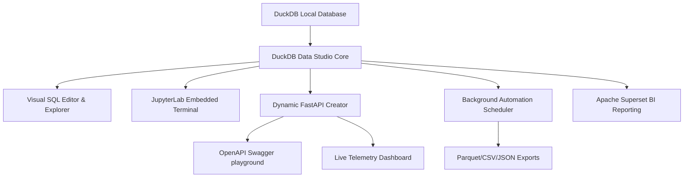

# 🦆 DuckDB Data Studio & API Explorer

**DuckDB Data Studio & API Explorer** is a high-performance visual IDE, microservice compiler, and automated background data pipeline manager designed specifically for **DuckDB**. It acts as a bridge between high-performance local database exploration and cloud-native microservice deployment. 

With DuckDB Data Studio, you can seamlessly write ad-hoc analytical SQL queries, instantly wrap them as FastAPI dynamic endpoints with auto-parsed query parameters, run cron-based ETL exports directly to Parquet or partitioned directories in the background, and monitor active request health and speeds using an integrated live telemetry dashboard.

---

## 📋 Table of Contents

* [💡 The Value Proposition & Developer Pain Points Solved](#-the-value-proposition--developer-pain-points-solved)
* [🚀 Key Architectural Pillars & Feature Set](#-key-architectural-pillars--feature-set)
* [🛠️ Technology Stack & Dependencies](#%EF%B8%8F-technology-stack--dependencies)
* [📦 Deployment & Container Settings](#-deployment--container-settings)
* [📂 Project Structure](#-project-structure)
* [🤖 AI Code Development Proof of Concept](#-ai-code-development-proof-of-concept)
* [🤝 Acknowledgments & Integrations](#-acknowledgments--integrations)

---

## 💡 The Value Proposition & Developer Pain Points Solved

Traditional analytical workflows are highly fragmented:
1. **Ad-Hoc Querying**: Developers run local SQL terminals or standalone scripts to analyze data.
2. **REST API Generation**: Once the query is finalized, developers must write boilerplate code in FastAPI, Flask, or Express, configure request parameter bindings, set up security sanitization, and manage response limits.
3. **Background ETL**: Automating reports requires configuring external schedulers (e.g. cron, Airflow, or Celery) and writing complex export functions.
4. **Telemetry Logging**: Setting up metrics tables, logging speeds, and tracking endpoint errors is an afterthought that takes significant setup time.

**DuckDB Data Studio solves all of this under a single unified dashboard**. It is the ultimate productivity suite for developers, data scientists, and analysts who want to turn local DuckDB databases into fully managed backend services in seconds.

---

## 🚀 Key Architectural Pillars & Feature Set



### 1. Visual SQL Editor & Interactive Catalog Explorer 📊
* **High-Performance Query Execution**: Execute complex analytical SQL queries instantly against local or attached databases with NiceGUI's premium responsive layout.
* **Safety Capped Previews**: SELECT queries automatically cap result-set fetching to a maximum of 10,000 rows, protecting the Python process memory and preventing UI freezes when querying large datasets.
* **Dynamic Parameterized Queries**: Write dynamic templates using the double-curly brace syntax (e.g., `{{ min_age }}`). The editor dynamically renders input fields, escapes quotes, and substitutes values securely before execution.
* **Schema Catalog Tree**: Visually browse schemas, tables, views, columns, and datatype catalogs via an interactive sidebar list, allowing fast discovery of database structures.
* **Persistent Query History**: Retain a robust history of executed statements (including run times, row counts, execution success, and errors) stored directly inside the config SQLite database. Features include quick clipboard copy and history element deletions.

### 2. Drag-and-Drop Data Import Wizard 📥
* **Schema Sniffing & Live Preview**: Drag-and-drop CSV, Parquet, or JSON files to automatically sniff schema types and view a grid layout preview of the parsing structures.
* **Interactive Column Mapping**: Rename column targets, choose delimiters, select collision handlers (Append, Replace, or Fail), and override data types (e.g. casting to `VARCHAR`, `INTEGER`, or `DOUBLE`) before writing.

### 3. Embedded JupyterLab Workspace 💻
* Embedded full-featured **JupyterLab** workspace terminal enabling seamless integration with notebooks for advanced Python, pandas, and machine learning pipelines side-by-side with your database operations.

### 4. Visual Extensions Manager 🔌
* Browse the rich DuckDB extension catalog (like `httpfs` for S3 query structures, `postgres_scanner`/`sqlite_scanner` for direct database scanners, `spatial`, and `icu`).
* Visually click to **Install** and **Load** extensions in real-time without writing manual SQL commands.

### 5. Database Seeding & Recovery Utilities 🛠️
* **Catalog Backups & Restore**: Create instant catalog structure backups and restore them in one click.
* **Custom Database Seeding**: Populate benchmark tables with custom-density test datasets in seconds to validate query architectures under scale.

### 6. FastAPI Endpoint Creator (Microservices Generator) ⚡
* **Instant Expose**: Compile any raw SQL query on-the-fly and host it as a dynamic REST API endpoint (e.g. `/api/recent-sales`).
* **Auto-Generated Query Parameters**: Use the `$parameter_name` notation to automatically capture dynamic query parameters from incoming requests (e.g. `?min_qty=10`). Includes custom analysis tools to parse table schemas and auto-generate parameter options.
* **Safe Metered API Pagination**: Avoid container crashes from massive responses. Enforces a default dynamic pagination limit of 100 records and a safety max limit ceiling of 10,000, automatically wrapping unbounded queries.

### 7. Interactive OpenAPI Docs & Explorer 📖
* Embedded visual sandbox playground designed in a modern Swagger UI layout.
* Inspect active dynamic endpoint schemas, input query parameters, test executions with real-time browser loopbacks, and view beautifully formatted JSON response blocks with live latency measurements.
* Powered by a dedicated **SQLite metadata store** (`_duckdb_studio_api_endpoints`) to guarantee endpoints remain persistent across app restarts.

### 8. Live API Metrics & Latency Dashboard 📈
* **KPI Telemetry Cards**: Monitor global health statistics, including Total API Requests, Average Latency (ms), and Global Success Rate percentage.
* **Granular Route Analytics**: Review a performance analytics table sorting endpoint routes by invocations, average response times, min/max bounds, success ratios, and last triggered timestamps.
* **Reset Operations**: Instantly truncate metrics log history to start fresh profiling sessions.

### 9. Background Query Scheduler & Exporter ⏰
* **Automated Data Pipelines**: Build period-based schedules (`Every Minute` to `Daily`) to automatically execute saved queries in a background thread.
* **High-Performance Exports**: Dump scheduled query results directly to the project's local `/exports/` directory as **Parquet**, **CSV**, or **JSON** files.
* **Native Partitioning**: Specify optional columns to partition the exported directories natively using DuckDB's ultra-fast `PARTITION_BY` option.
* **Automation Grid**: Manage automation profiles with interactive pause/resume toggles, manual trigger buttons, and visual execution log tables.

---

## 🛠️ Technology Stack & Dependencies

* **Frontend Framework**: [NiceGUI](https://nicegui.io/) (High-performance web interface builder based on TailwindCSS and Quasar)
* **Backend Framework**: [FastAPI](https://fastapi.tiangolo.com/) (Asynchronous high-performance REST API routing)
* **Database Engine**: [DuckDB](https://duckdb.org/) (In-process analytical database engine)
* **Visual Theme**: Glassmorphic UI colors, HSL visual gradients, Outfit body typography, JetBrains Mono editor typography, custom card shadows, and visual feedback toasts.

---

## 📦 Deployment & Container Settings

The application is fully containerized and runs with hot-reloading configurations under Docker.

### Running with Docker Compose
To build and start the environment:
```bash
docker compose up -d --build
```

### Accessing the Web Interfaces
* **DuckDB Data Studio Web Dashboard**: [http://localhost:8086](http://localhost:8086)
* **Dynamic REST API Base URL**: `http://localhost:8086/api/<endpoint-slug>`
* **JupyterLab Terminal**: Access via the embedded tab or container ports.
* **Apache Superset Workspace**: Access via the embedded reporting tab.

---

## 📂 Project Structure

* [main.py](main.py): Primary codebase containing the web application core, NiceGUI layouts, background scheduler daemon, and FastAPI routing handlers.
* [exports/](exports/): Target directory for automated background query files.
* [databases/](databases/): Mounted database folder containing the DuckDB databases (e.g. the default primary `main.duckdb` file).
* [config/app_config.db](config/app_config.db): Separate SQLite database containing all app settings, configurations, schedules, query histories, and metrics.

---

## 🤖 AI Code Development Proof of Concept

This application is a **Proof of Concept (PoC)** built using advanced agentic AI coding assistants. All layout design systems, API dynamics, container structures, and SQLite state integrations were designed, implemented, and refactored through iterative AI pair programming. It serves as a demonstration of building complex, production-ready, full-stack database exploration and API deployment tooling purely via AI agents.

---

## 🤝 Acknowledgments & Integrations

DuckDB Data Studio integrates several powerful open-source cloud-native projects to create a unified data workspace:
* **[Apache Superset](https://superset.apache.org/)**: An enterprise-grade business intelligence reporting platform. Fully integrated with embedded authentication bypasses, persistent Postgres database driver hooks (`psycopg2`), and pre-configured datasource attachments for PGWire connections.
* **[Garage S3](https://garagehq.nz/)**: A lightweight, high-performance distributed object storage service implementing the Amazon S3 API. Garage allows DuckDB Data Studio to model, test, and run S3 data lake queries locally using standard S3 connection strings.
* **[dbt Code Server (VS Code)](https://github.com/coder/code-server)**: An embedded editor server hosting VS Code, pre-configured with the **dbt Power User** extension, **`sqlfmt`** Jinja formatter, and the **`dbt-duckrun`** adapter. This allows developers to build, format, compile, and run modular SQL pipelines directly in the workspace, compiling data models natively as Delta Lake tables stored on local Garage S3 storage.
* **[JupyterLab](https://jupyter.org/)**: Enables embedded Python notebook workspaces integrated directly alongside the DuckDB database layers.
* **[duckrun](https://djouallah.github.io/duckrun/)**: A specialized python database connection helper library for DuckDB. In DuckDB Data Studio, `duckrun` acts as the execution adapter base to cleanly query S3 Delta Lake catalogs, provision credentials, and run local Pandas DataFrame registrations natively.
* **[FastAPI & SlowAPI](https://fastapi.tiangolo.com/)**: Serves as the microservice framework for dynamic API endpoints, including custom JWT (HS256) security, slowapi rate-limiting throttle policies, and NDJSON streaming query results.
